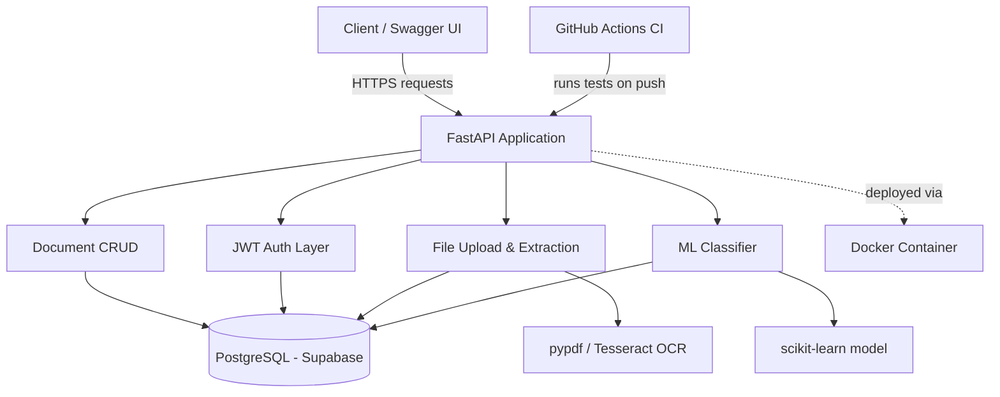

# Document Review System

An automated document intake and review pipeline: documents are uploaded, text is extracted, a trained classifier predicts document type, and a role-based reviewer workflow tracks approval status with a full audit history — inspired by a document verification workflow I built professionally in Mendix, rebuilt here from scratch in code.

## Why this project

I've spent my professional experience building enterprise applications in Mendix (low-code), including a document verification system integrated with Claude AI. This project rebuilds that same real-world problem at the code level — backend engineering, authentication, a self-trained machine learning model, automated testing, and CI/CD — to demonstrate genuine software engineering and applied ML skills beyond low-code tooling.

## Architecture



## Tech stack

| Layer | Tool |
|---|---|
| Backend framework | Python, FastAPI |
| Database | PostgreSQL, hosted on Supabase |
| Authentication | JWT (python-jose), bcrypt password hashing |
| Machine Learning | scikit-learn (TF-IDF + Logistic Regression) |
| Document processing | pypdf (PDF text), Tesseract OCR (images) |
| Containerization | Docker (multi-stage build) |
| CI/CD | GitHub Actions |
| Testing | pytest, with fixtures for auth |
| Dev environment | GitHub Codespaces (cloud-based, no local install needed) |

## API reference

Full interactive API documentation is auto-generated and available at `/docs` (Swagger UI) or `/redoc` when the app is running.

Key endpoints:

| Method | Endpoint | Description |
|---|---|---|
| POST | `/register` | Create a new user (reviewer or admin) |
| POST | `/login` | Authenticate and receive a JWT |
| POST | `/documents` | Create a document record |
| GET | `/documents` | List documents, optional status filter |
| GET | `/documents/{id}` | Get a single document |
| POST | `/documents/upload` | Upload a PDF/image; extracts text and fields automatically |
| POST | `/documents/{id}/classify` | Predict document type from text using the trained classifier |
| PATCH | `/documents/{id}/status` | Approve/reject a document (reviewer/admin only), with optional comment |
| DELETE | `/documents/{id}` | Delete a document (admin only) |
| GET | `/review-queue` | List all pending documents (reviewer/admin only) |
| GET | `/documents/{id}/history` | Full status change history for a document |

## Running locally

```bash
cd app
source .venv/bin/activate
pip install -r requirements.txt
uvicorn main:app --reload --host 0.0.0.0 --port 8000
```

## Running with Docker

```bash
cd app
docker build -t doc-review-app .
docker run -p 8000:8000 --env-file .env doc-review-app
```

## Running tests

```bash
cd app
pytest -v
```

Tests also run automatically on every push via GitHub Actions (see badge above).

## Project structure

## Engineering roadmap (complete)

- [x] **Phase 1** — Backend Foundation: FastAPI, Docker, PostgreSQL, environment variables
- [x] **Phase 2** — Database & API Design: models, CRUD, API organization
- [x] **Phase 3** — Authentication & Security: JWT, roles, password hashing
- [x] **Phase 4** — Machine Learning: dataset, trained classifier, evaluation, integration
- [x] **Phase 5** — Document Processing: file upload, text extraction (PDF/OCR), field extraction
- [x] **Phase 6** — Review Workflow: pending queue, approve/reject, comments, status history
- [x] **Phase 7** — Quality Engineering: test fixtures, logging, centralized error handling, validation
- [x] **Phase 8** — DevOps & Deployment: multi-stage Docker, centralized config, GitHub Actions CI
- [x] **Phase 9** — Documentation: README, architecture diagram, API reference

## Future Improvements

- **Database migrations (Alembic)** — currently schema changes are handled by dropping and recreating tables in development; a production system would use proper migrations to change schema without data loss.
- **Cloud file storage (e.g. AWS S3)** — uploaded files are currently processed in memory and not persisted; a production version would store the original files, not just extracted text.
- **Larger, real-world training dataset** — the document classifier is trained on a small, hand-built dataset (32 examples); accuracy would improve meaningfully with more real labeled examples.
- **Rate limiting** — API endpoints currently have no request throttling; production APIs typically limit requests per user/IP to prevent abuse.
- **Full cloud deployment** — currently runs in GitHub Codespaces and locally via Docker; next step is deploying to a platform like Render, Railway, or AWS for a live public URL.
- **Refresh tokens** — access tokens currently expire after 60 minutes with no refresh mechanism; a production auth system would add refresh tokens for a smoother user experience.

## Author

Ayse Atanoglu